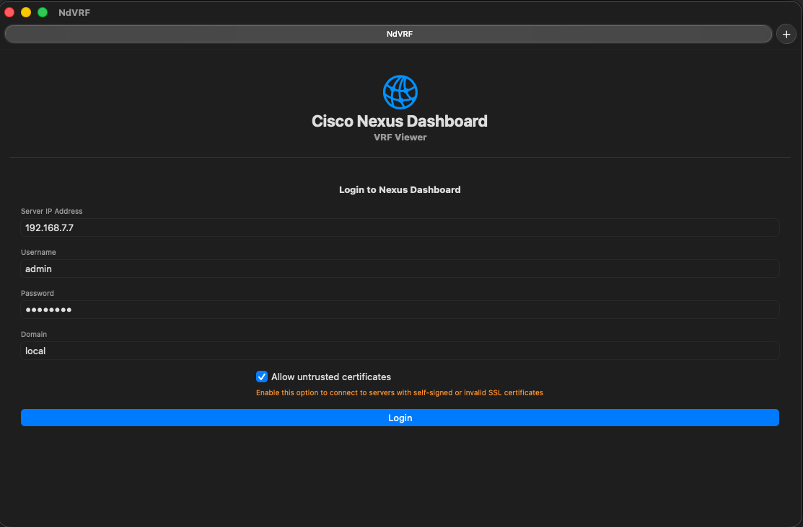
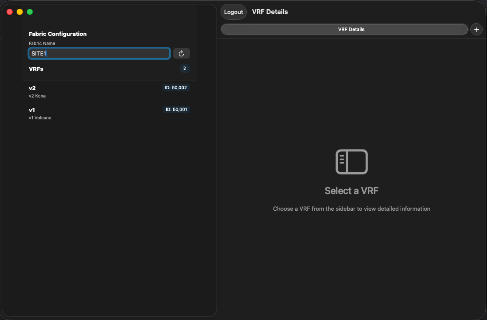
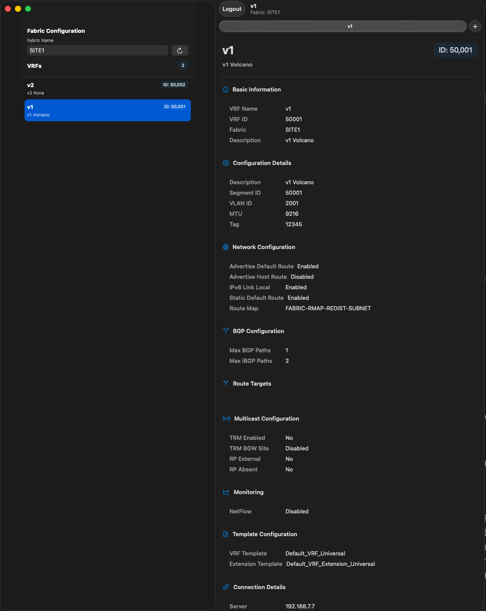

# NdVRF

Just playing around with Swift and SwiftUI to get a feel feel for writing a REST client to interact with Cisco's Nexus Dashboard.

Currently, this is a very basic client that can login to Nexus Dashboard and display information about VRFs in a fabric.

## Login Screen

## Fabric Selection

## VRF Detail

